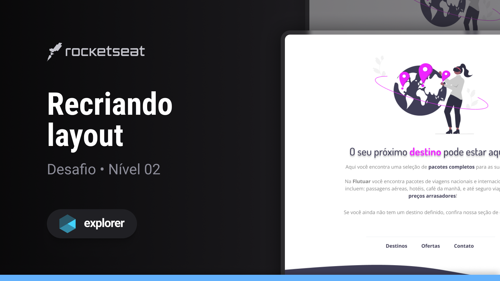

## Sobre o desafio

Este desafio consiste em uma interface web simples, construída como parte da trilha Explorer oferecida pela Rocketseat.
O objetivo principal é praticar os conceitos fundamentais de estrutura semântica e flexbox. Nesse desafio, 
foram aplicados os seguintes conceitos:

Conceitos aplicados
* Conceitos de HTML e CSS estruturando de forma semântica
* Aprender a utilizar a ferramenta Figma
* Aplicar fontes e cores personalizadas em nossos projetos
* Entender como posicionar e espaçar os elementos utilizando os conceitos de Box Model e Flexbox do CSS.

 ## Tecnologias
- HTML
- CSS
- Figma

  
## Layout do desafio
<table>
  <tr>
    <td></td>
  </tr>   
</table>

## Demonstração
Aqui está uma prévia do resultado final do projeto desenvolvido
[Link Demonstração](https://rs-ferreira.github.io/Flutuar.com/)

## Contato
Se você tiver alguma dúvida ou quiser entrar em contato, você pode me enviar uma mensagem pelo
[LinkedIn](https://www.linkedin.com/in/ronaldosf)."
